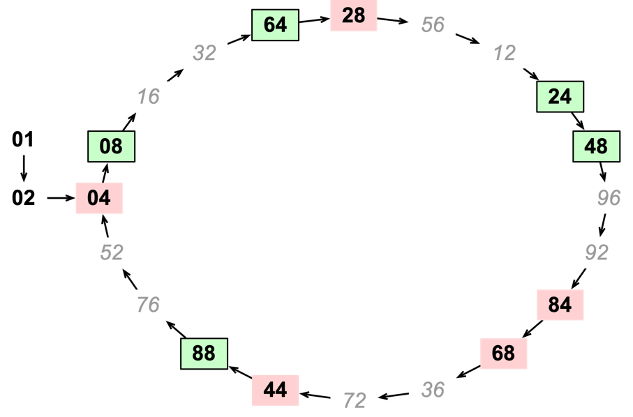

# Fast Scanner for OEIS Sequence A068994

The programs here implement a fast scanning technique designed to find powers of
two whose digits are all even. The technique is based on building a large sieve
that can eliminate most candidates without examination. Only the very few
elements that pass through the sieve need to be examined in depth.

These programs were able to extend the number of powers of two with no new
elements of A068994 to n < 10^14 running for about 10-12 hours on a single core
of a laptop computer.

## Construction of the Sieve

The sieve is constructed by noting that the low order digits of powers of two
must eventually enter a cycle since they are taken from a finite set. Many of
these lower order digits contain an odd digit. We can skip any power of two that
has these digits. About half of the remaining elements of the cycle follow an
element that would cause a carry when doubled which implies that the digit just
to the left of the digits we are examining would be odd. We can skip these
elements as well.

The following diagram illustrates the cycle for the least significant two digits
of powers of two. In this diagram, we start with $2^0$ which has 01 as the lower
two digits and then proceed to 02, 04, 08, 16 and so on. The 10 values with an
odd digit are shown in faded italic lettering. Those with all even digits which
are preceded by a value large enough to cause a carry are marked with a red
background and have no border. The values 01 and 02 are outside of the cycle and
are marked with an oval shape. The remaining 5 values (08, 24, 48, 64, and 88)
are the elements of the sieve; all powers to two not ending in these values can
be eliminated without examination.



The sieve for two digits is well known since at least 2002. But there is no need
to stop with two digits. The program `cycle/cycles.go` computes the content of
analogous sieves for any reasonable number of digits. The value in going to
longer cycles is that the fraction of values in the cycle that have to be
examined drops dramatically as more digits are used. For instance, at 13 digits,
the cycle of lower digits extends to 976,562,500 values, but only 112,846 need
to be evaluated compared to the 5/20 that need to be evaluated when considering
2 digits. This gives a speedup of roughly 2000x when we have $n > 30$.

## Scanning Candidate Values

Actually testing values of $2^n$ to see if all digits are even does not usually
require that the entire value be computed. This is good
because $2^{10^{14}} \approx 3 \times 10^{10^{13}}$ (that is, it has $10^13$
digits all together). Fortunately, for all values scanned so far, an odd digit
occurs in the least significant 46 digits. This means that computing just the 50
or 60 least significant digits will suffice to eliminate candidate values.

Since 60 digits of decimal precision requires only 200 bits, it will still take
an extended precision library, but it doesn't have to be very exotic.
Hand-rolling something using base-10 is possible, but very unlikely to be faster
than something that uses native arithmetic.

## Multi-threading The Search

This search process can be multi-threaded very easily since the search for each
repetition of the sieve is independent of every other. Further, once you have a
large cycle, examining the candidates takes a significant amount of time so the
mechanism for distributing work no longer matters to performance.

The code here distributes work to workers through a single channel. Assignments
are distributed in ascending order so that the work of computing the starting
point can be re-used by each worker.

Even without multi-threading, the system is very fast. Searching the
first $10^14$ values of $2^n$ took about 10 hours using a single core on my
laptop.

# Running the code

To run the search, you first need to find the cycle for some number of digits.
Once you have the sieve you want, you use that to run the search. There is a bit
of trade-off here. Using a larger cycle as the basis for the sieve makes the
search more efficient, but larger sieves use more memory and may not fit into
the cache. For a laptop, using 12 or 13 digits for the sieve seems about right.

## Generating a Sieve

To run this code, you start with the cycle generator.

```
% go run cycle/cycles.go  
                                                                    gain vs 
  digits  tail           cycle  exclude  maximal   last    even    brute force
       1     1               4     true     true      1       2       2.00
       2     2              20     true     true      2       5       4.00
       3     3             100     true     true      4      12       8.33
       4     4             500     true     true      8      30      16.67
       5     5           2,500     true     true     16      74      33.78
       6     6          12,500     true     true     32     185      67.57
       7     7          62,500     true     true     64     462     135.28
       8     8         312,500     true     true    128   1,156     270.33
       9     9       1,562,500     true     true    256   2,889     540.84
      10    10       7,812,500     true     true    512   7,221   1,081.91
      11    11      39,062,500     true     true  1,024  18,056   2,163.41
      12    12     195,312,500     true     true  2,048  45,139   4,326.91
      13    13     976,562,500     true     true  4,096 112,846   8,653.94
      14    14   4,882,812,500     true     true  8,192 282,111  17,308.13
```

A side effect of running this program is the creation of a number of JSON files
that each encode a sieve. Here, for instance, is the file for the 2 digit sieve:

```
{
  "Mask": 100,
  "Order": 2,
  "Length": 20,
  "Leadin": 2,
  "EvenItems": 5,
  "Gain": 4,
  "Cycle": [8, 24, 48, 64, 88],
  "Index": [3, 6, 10, 11, 19]
}
```

The cycle generator uses Floyd's tortoise and hare algorithm to find the cycle
as well as the steps from $2^0$ to the first element of the cycle. All of the
values in the cycle are sorted. When the cycle is read into the search program,
the differences between successive indexes are used to step from one candidate
to the next. Note that the mask in the cycle file only defines the size of the
cycle and is different from the mask used in the search program where the mask
defines how many significant digits are used to disqualify candidate values.

## Running the Search

You can run a simplified search that only uses the 2-digit sieve using the
program `simple/scan-simple.go`. This allows the following options:

| Option      | Meaning                                                          |
|-------------|------------------------------------------------------------------|
| -verbose    | Provide progress information                                     |
| -limit n    | How many candidates to search. Use M, G, T, P, or E as desired   |
| -digits d   | How many digits to check for even digits                         |
| ----------- | ---------------------------------------------------------------- |

This program is single-thread and can scan about 5M candidates per second.

The program `sieve/scan.go` is a more complex scanner. It allows a choice of how
many threads to use as well as selection of the sieve. By default, a 13-digit
sieve is used. The following options are allowed:

| Option      | Meaning                                                          |
|-------------|------------------------------------------------------------------|
| -verbose    | Provide progress information                                     |
| -limit n    | How many candidates to search. Use M, G, T, P, or E as desired   |
| -digits d   | How many digits to check for even digits                         |
| -threads t  | How many threads to use to check candidates                      |
| -sieve s    | The name of a JSON file containing a sieve definition.           |
| ----------- | ---------------------------------------------------------------- |

This scanner can scan about 10M candidates per second per thread with
`cycle-002.json` (the standard 2-digit sieve) but accelerates to 85M candidates
per second with `cycle-009.json` and to roughly 10G candidates per second per
thread with `cycle-013.json`. 


